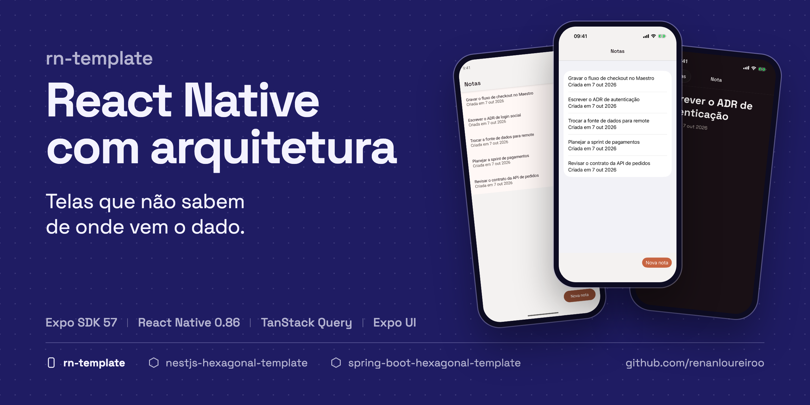
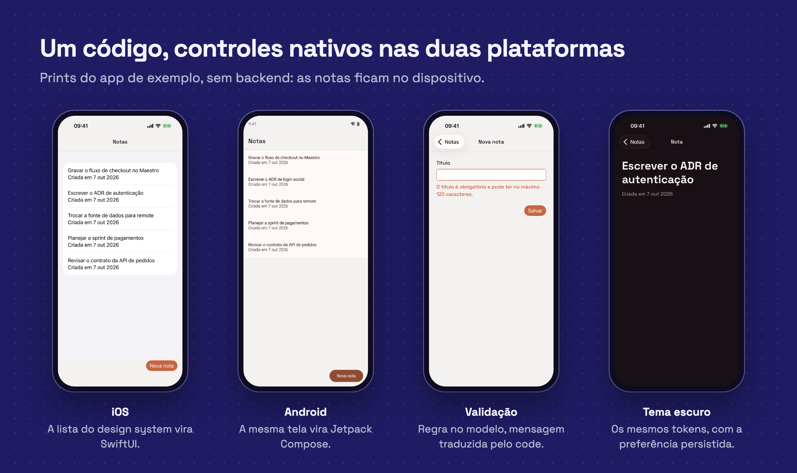

# RN Template

<!-- template:start -->



[](https://github.com/renanloureiroo/rn-template/actions/workflows/ci.yml)


**Um app React Native que já nasce com arquitetura de produto: telas que não sabem de onde vem o
dado, cache que funciona offline e regras de arquitetura que o CI cobra por você.**

Começar um app é fácil. Difícil é ele continuar fácil de mudar no sexto mês, com três pessoas
mexendo nele. Este template resolve antes da primeira feature as decisões que costumam virar
dívida: onde mora a regra de negócio, como a tela recebe dados, como testar sem mockar meio app e
como impedir que alguém atravesse as camadas numa sexta à tarde.

[**→ Use this template**](https://github.com/renanloureiroo/rn-template/generate)



## Por que usar

- **Telas simples, ViewModels testáveis.** Cada tela fala com um único hook, a ViewModel, que
  devolve estado pronto para exibir (`loading | error | empty | ready`) e ações. A tela não conhece
  API, cache, store nem navegação.
- **Fonte de dados trocável sem tocar na UI.** Cada repositório é um contrato com implementação
  remota, local e fake. Uma variável de ambiente alterna entre a API e o armazenamento do
  dispositivo; ViewModels e telas não mudam.
- **Offline desde o primeiro dia.** TanStack Query com cache persistido no MMKV: a última tela
  vista abre sem rede e é revalidada quando a conexão ou o foco do app voltam.
- **UI nativa com design system próprio.** Componentes sobre Expo UI (SwiftUI no iOS, Jetpack
  Compose no Android), com tokens, tema claro e escuro e i18n em inglês e português.
- **Erros que a tela entende.** O `HttpClient` lê o RFC 9457 que o backend publica e preserva o
  `code` do servidor. A tela traduz pelo `code`, nunca pela mensagem.
- **Arquitetura cobrada pelo CI.** ESLint e dependency-cruiser quebram o build quando uma tela
  importa um repositório, uma feature importa outra ou o `shared` passa a conhecer uma feature.
- **Testes sem mocks.** Cada contrato tem um fake de verdade. Testar uma ViewModel é entregar outro
  objeto ao provider da feature; telas são testadas pelo que aparece, e o Maestro cobre o E2E.
- **Expo Router ou React Navigation, à sua escolha.** O workflow de inicialização mantém a variante
  escolhida e remove a outra, inclusive a dependência.
- **Debug sem app externo.** React Native DevTools com painéis do Rozenite para o cache do TanStack
  Query, o conteúdo do MMKV e as requisições de rede.
- **Pronto para agentes de código.** `AGENTS.md`, documentação prescritiva e ADRs dão a qualquer
  agente as mesmas regras que o time segue.

## O que vem pronto

| Área              | Escolha                                                               |
| ----------------- | --------------------------------------------------------------------- |
| Plataforma        | Expo SDK 57, React Native 0.86 (nova arquitetura, Hermes), TS estrito |
| UI                | design system sobre Expo UI, Reanimated e Gesture Handler             |
| Dados do servidor | TanStack Query com cache persistido no MMKV v4                        |
| Estado do cliente | Zustand, com store por provider e seletores atômicos                  |
| Navegação         | Expo Router ou React Navigation, escolhida na inicialização           |
| i18n              | i18next, inglês e português                                           |
| Debug             | React Native DevTools com Rozenite (Query, MMKV, rede, navegação)     |
| Testes            | Jest, React Native Testing Library e Maestro                          |
| Qualidade         | ESLint, Prettier, dependency-cruiser e CI no GitHub Actions           |
| Builds            | perfis EAS locais para simulador, dispositivo, preview e produção     |
| Documentação      | arquitetura, estratégia de testes, ADRs e `AGENTS.md`                 |

## Arquitetura em 30 segundos

```text
View ──► ViewModel ──► TanStack Query ──► NotesRepository (contrato)
                                              ├── RemoteNotesRepository ──► API
                                              ├── LocalNotesRepository  ──► MMKV
                                              └── FakeNotesRepository   ──► testes
```

O código é organizado por feature (`src/features/<feature>`): apagar a pasta apaga a feature,
inclusive os testes. O desenho segue os guias oficiais de arquitetura do
[Flutter](https://docs.flutter.dev/app-architecture/guide) e do
[Android](https://developer.android.com/topic/architecture), adaptados para React, com SOLID
aplicado sem cerimônia: só a raiz de composição (`src/bootstrap`) cria implementações e decide
qual roda. O passo a passo está em [docs/ARCHITECTURE.md](docs/ARCHITECTURE.md).

## Uma família de templates

| Template                                                                                           | Stack                       | Papel      |
| -------------------------------------------------------------------------------------------------- | --------------------------- | ---------- |
| **rn-template** (este)                                                                             | Expo, React Native          | app mobile |
| [nestjs-hexagonal-template](https://github.com/renanloureiroo/nestjs-hexagonal-template)           | Node.js 24, NestJS, Drizzle | API        |
| [spring-boot-hexagonal-template](https://github.com/renanloureiroo/spring-boot-hexagonal-template) | Java 21, Spring Boot, JPA   | API        |


Os três falam o mesmo contrato: a mesma API de notas de exemplo, erros RFC 9457 com o mesmo `code`
estável e o mesmo vocabulário de `ErrorType`. O time escolhe o backend pela linguagem que domina,
e o `HttpClient` do app lê os erros de qualquer um dos dois sem adaptação.

## Comece em um minuto

1. Clique em [**Use this template**](https://github.com/renanloureiroo/rn-template/generate) e dê
   ao repositório o nome do projeto, por exemplo `orders-app`.
2. Em **Actions → Template init → Run workflow**, escolha a navegação. O workflow renomeia app,
   bundle id e scheme a partir do nome do repositório.
3. Clone e rode:

   ```bash
   cp .env.example .env
   npm install
   npm run ios        # ou npm run android
   ```

Não precisa de backend para começar: as notas do exemplo ficam no dispositivo. Os detalhes estão
em [Usando como template](#usando-como-template).

---

<!-- template:end -->

App mobile com Expo SDK 57 (React Native 0.86), organizado por feature com MVVM, design system
próprio sobre Expo UI, TanStack Query com cache persistido no MMKV, Zustand, Jest e Maestro.

A feature `notes` mostra o caminho completo: View → ViewModel → TanStack Query → repositório
(API ou armazenamento local). Ela deve ser removida ou renomeada quando a primeira feature real
for criada.

## Requisitos

- Node.js 24 (`nvm use`);
- Xcode (iOS) e/ou Android Studio (Android);
- [Maestro](https://maestro.mobile.dev), opcional, para os testes E2E.

O app usa módulos nativos (MMKV v4, keyboard controller, Expo UI), então roda em um
[development build](https://docs.expo.dev/develop/development-builds/introduction/), não no Expo
Go.

## Rodando localmente

```bash
cp .env.example .env
npm install
npm run ios        # ou npm run android
```

O primeiro `npm run ios` / `npm run android` gera o projeto nativo e instala o development
build. Depois disso, `npm start` basta enquanto nenhuma dependência nativa mudar.

### Fonte de dados do exemplo

Por padrão, as notas ficam no dispositivo (MMKV) e o app funciona sem backend. Para usar a API
dos templates de backend:

```bash
EXPO_PUBLIC_NOTES_DATA_SOURCE=remote
EXPO_PUBLIC_API_URL=http://localhost:8080/api
```

A troca acontece só em `src/bootstrap/app-dependencies.ts`: modelo, ViewModels e Views não
mudam. No emulador Android, rode `npm run adb` para que `localhost` alcance a
máquina.

> Os templates de backend publicam `POST /api/notes` e `GET /api/notes/{id}`. A listagem usa
> `GET /api/notes?page=0&size=20`, que devolve `{ items, total }` no formato de `Page`; esse
> endpoint precisa existir no backend para a lista funcionar no modo `http`.

## Debug

`j` no terminal do `npm start` abre o React Native DevTools, com painéis do
[Rozenite](https://www.rozenite.dev) para o cache do TanStack Query, o conteúdo do MMKV e as
requisições de rede. Os painéis só existem em desenvolvimento; veja
[docs/ARCHITECTURE.md](docs/ARCHITECTURE.md#ferramentas-de-desenvolvimento).

## Testes

```bash
npm test
npm run verify
npm run test:e2e
```

`npm run verify` é o portão de entrega: lint, regras de arquitetura (ESLint e
dependency-cruiser), typecheck, testes e bundle de iOS e Android. Os testes E2E exigem o
development build instalado no simulador. Veja [docs/TESTS.md](docs/TESTS.md).

## Navegação

<!-- template:start -->

O template traz as duas variantes de navegação e funciona com Expo Router até ser inicializado.
A inicialização mantém uma e remove a outra, inclusive a dependência: desde o SDK 56 as duas
não podem ser misturadas no mesmo app. As telas são as mesmas nas duas, porque não conhecem a
navegação.

<!-- template:end -->

<!-- navigation:expo-router:start -->

Expo Router, com rotas por arquivo em `src/app`. Cada rota só liga parâmetros e navegação às
telas de `src/features/*/views`.
<!-- navigation:expo-router:end -->

<!-- navigation:react-navigation:start -->

React Navigation (native stack) em `src/navigation`. Cada rota só liga parâmetros e navegação
às telas de `src/features/*/views`.
<!-- navigation:react-navigation:end -->

<!-- template:start -->

## Usando como template

Clique em **Use this template** e dê ao repositório o nome do projeto, por exemplo `orders-app`.
Depois, em **Actions → Template init → Run workflow**, escolha a navegação. O workflow renomeia
tudo a partir do nome do repositório e commita o resultado:

| Item                        | Exemplo para `orders-app` |
| --------------------------- | ------------------------- |
| `name` do `package.json`    | `orders-app`              |
| Nome do app (`app.json`)    | `OrdersApp`               |
| Scheme de deep link         | `ordersapp`               |
| Bundle id / package Android | `com.ordersapp`           |
| Navegação                   | a escolhida no workflow   |

Para inicializar localmente, depois de clonar:

```bash
scripts/init-template.sh orders-app                               # Expo Router
scripts/init-template.sh orders-app --navigation=react-navigation # React Navigation
npm ci
npm run verify
```

Depois da inicialização:

1. ajuste `description` no `package.json` e troque ícones e splash em `assets/images`;
2. remova ou renomeie `src/features/notes`, suas rotas, sua entrada em
   `src/bootstrap/app-dependencies.ts` e no `AppShell`, e suas chaves de i18n;
3. substitua este README pela apresentação do produto;
4. revise as decisões abertas em `docs/ARCHITECTURE.md` e registre as que forem tomadas em
   `docs/adr`.

<!-- template:end -->

## Documentação

- [Arquitetura](docs/ARCHITECTURE.md)
- [Testes](docs/TESTS.md)
- [Decisões de arquitetura (ADRs)](docs/adr/README.md)
